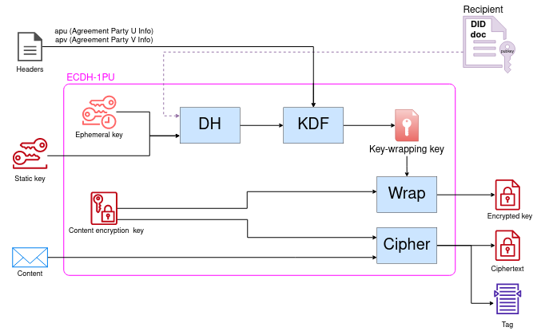
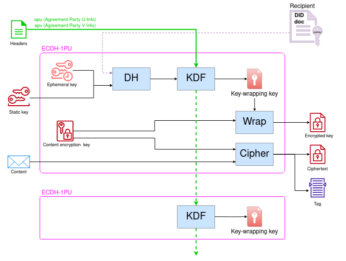

# A path towards forward secrecy in DIDComm

* By Dan Carez (carezd gmail com)
* A proposal to achieve forward secrecy and post-compromise security via the integration of ratcheted key exchanges in DIDComm.
* #didcomm #forward-secrecy #post-compromise-security #ratcheted-key-exchange

## Abstract

In this paper, we aim to explore potential extensions to DIDComm 
that would enhance its security properties whilst preserving the 
protocol's asynchronous focus.  
We delve into the concepts of forward secrecy and post-compromise security
in the context of secure asynchronous messaging, examining how ratcheted key exchanges 
contribute to these security aspects.
We discuss how the key exchange 
mechanisms employed by DIDComm provide limited assurances in this 
area, and propose an adaptation of the Double Ratchet algorithm 
to the DIDComm context.

## Introduction

In secure messaging, the requirement for asynchronicity (the ability of two entities to communicate without being online simultaneously)
has far reaching implications.  
First, security cannot rely on an interactive handshake where entities agree 
on the cryptographic material that will be used during a communication session.  
Second, communication sessions can present unbounded duration, that is,
without clear session establishment mechanisms, communications can extend for months or years,
being only limited by the duration of the relationship itself.

These issues stress the need for sophisticated security features such as *forward secrecy* and
*post-compromise security*, which aim to restrict the extent of potential breaches in the event of 
a private key compromise.  
*Forward secrecy* (FS) protects messages exchanged *before* a compromise
by ensuring that the cryptographic material used is secure against
a future compromise of the static private keys of the participants [2].  
*Post-compromise security* (PCS) protects messages exchanged *after* a party’s secrets have been compromised.
In PCS, if an attacker is able to fully compromise one entity for a given time window, communications happening after the compromise has ended become secure again after a finite interval [3, 4].
This is sometimes described as the ability to "self-heal" after a compromise.

DIDComm Messaging[1] provides asynchronous and end-to-end encrypted communication
on top of DIDs, but provides limited forward secrecy and post-compromise security guarantees.  
To discuss improvements in this area, in the sections that follow we introduce the concepts of 
*ratcheted key exchanges*,
describe the encryption mechanisms of DIDComm,
and propose an adaptation of the *Double Ratchet algorithm* to the DIDComm context.

## Background and related work

### Ratcheted key exchanges in messaging

Traditionally, asynchronous secure messaging systems like PGP (Pretty Good Privacy) have not 
offered advanced security features such as forward secrecy.  
*Off-the-record* messaging (OTR) [5]
was among the first protocols to provide practical forward secrecy
by attaching fresh public keys to every exchanged message, and then using those
to continuously derive a new Diffie-Hellman shared secret.
Since the shared secret continuously moves forward, but it is not possible to infer its previous values,
the technique came to be known as "ratcheting".  
However, OTR presents limited support for asynchronous communications.
First, there is no method to perform the initial key exchange without full interaction by both peers. 
Second, the ratchet only moves forward upon reception of a message, therefore keys will not be rotated 
if one peer is offline or unresponsive.

The Signal protocol used by popular applications like
Signal, WhatsApp and Facebook Messenger
is the most widely adopted protocol for forward-secret asynchronous messaging.
The protocol achieves forward secrecy and post-compromise security by using the 
*Double Ratchet* (DR) algorithm,
a combination of a Diffie-Hellman ratchet (like the one used in OTR) and a 
HMAC-based symmetric ratchet [6, 7].

### DIDComm key exchange

DIDComm encryption is implemented by one of two *hybrid encryption* [8] mechanisms,
namely *anoncrypt* or *authcrypt*, which are respectively based in the *ECDH-ES* and *ECDH-1PU*
key exchange mechanisms [9, 10].

Both approaches provide equivalent properties in terms of forward secrecy,
so we will limit our analysis to *authcrypt* in the rest of this paper.

In essence, *authcrypt* 
first performs two Diffie-Hellman key exchanges (one *ephemeral-static* and one *static-static* [2])
using the sender's private keys and the recipient's public key.
Then a *key derivation function* (KDF) is used to generate a *key-wrapping key* that encrypts the
actual key used for content encryption. The process is shown in the following figure:

With a simple analysis of this key exchange mechanism, we can observe that the sender contributes
ephemeral cryptographic material that can be eagerly deleted, thus making the protocol forward secret
against a compromise of the sender’s private key.
However, no ephemeral material is contributed from the receiver’s side,
which exposes all key exchanges (and therefore all message contents) to compromises of the recipient’s private key.
This weakness applies to both passive and active attackers.

### DID rotation support in DIDComm

DIDComm provides support for simple DID rotation scenarios by using a `from_prior` header containing
the rotation information signed by the previous DID.
However, we argue that the feature presents two important limitations:

1. Since DID rotations only update the cryptographic material of the sender,
series of messages sent without receiving a response cannot update the recipient's public key
material and are therefore not forward-secret againts the compromise of the recipient's private key.  
This scenario is not uncommon in asynchronous messaging, and is particularly problematic
in group (multi-recipient) messaging, where a single offline member can potentially compromise a long history 
of group messages. This limitation is equivalent to the one presented by the *Off-the-record* messaging protocol.
1. As the *DIDComm Messaging* standard neither enforces rotations nor specifies mechanisms 
to orchestrate more elaborate 
rotation mechanisms, 
achieving forward secrecy in an interoperable manner is challenging.

## A basic DID ratchet

We propose a new mode of DIDComm communication as an initial step towards further 
standardising DID rotation in DIDComm. In this proposed mode, a new DID is generated at every 
communication 'turn'. This means that entities will create a new DID each time they receive a 
message. This new DID will then be used for all outgoing messages until the next incoming 
message is received, which in turn prompts the generation of another new DID.

This mechanism notably shortens the lifespan of keys from being entirely
static, with an indefinite duration, to the timeframe extending from the
receipt of one message to the receipt of the next.

The mechanism uses the standard `from_prior` DIDComm rotation header to 
sign rotations with the previous DID.  
DID methods with pairwise scope such as `did:key` or `did:peer` are well suited for the 
generation of ephemeral DIDs.

This method resembles the Diffie-Hellman ratchet used in the *Double Ratchet*
algorithm, and provides post-compromise security and forward secrecy after a communication
round-trip is completed.  
However, messages sent without reception of a response are still vulnerable to compromises
of the recipient's private key.

## Double Ratchet for DIDComm

To further reduce the scope of key compromises to the (optimal) granularity of individual 
messages, we combine the DID ratchet presented above with a symmetric ratchet that,
for every message, rotates the *key-wrapping key* generated during the *ECDH-1PU* key 
exchange.

The process requires chaining an output produced by the *ECDC-1PU* key derivation function
(KDF) into the input of the KDF used for the next message.
The fresh encryption keys produced at every iteration can be 
deterministically and independently computed by both entities, which maintains the
asynchronicity of the protocol.

This process is analogous to the HMAC-based symmetric ratchet used by the Double Ratchet
algorithm [6], and provides forward-secrecy at the level of individual messages.
As the ratchet is built using hash functions,
a compromise of the full state of an entity would allow the attacker to obtain future
keys by simply using the ratchet, but previous keys cannot feasibly be obtained if the hash
function is secure.

The following figure summarises the proposed symmetric ratchet, with the
modification required in the key exchange mechanism shown in green colour:

Note that this mechanism modifies the internal behaviour of the *ECDH-1PU* key exchange,
therefore changes in this key exchange or its interface with DIDComm will be necessary.  
The analysis of such changes is beyond the scope of our proposal, but we present three possible 
paths in the discussion section below.

## Evaluation

Assuming a correct implementation of the selected cryptographic primitives, we can provide an 
informal evaluation of the security properties achievable with the proposed protocol.

The table below compiles the evaluation results for forward secrecy and post-compromise security.

| Property                | DIDComm (w/o rotation) | Proposed DID ratchet | Proposed double ratchet | Signal protocol [7] |
|-------------------------|---------|-------------------|--------------|-------------|
|**Sender's Key Compromise** |  |  |  | |
| Forward secrecy         | yes      | yes              | yes          | yes         |
| Post-compromise security| yes     | yes               | yes          | yes         |
|**Receiver's Key Compromise** |  |  |  | |
| Forward secrecy         | no      | only after  round-trip | yes          | yes |
| Post-compromise security| no      | yes                | yes          | yes        |

## Discussion

### Accommodating a symmetric ratchet into an ECDH key exchange mechanism

While the proposed `DID ratchet` is directly supported by DIDComm,
the `Double Ratchet for DIDComm` proposal requires changes in the key exchange mechanism used
by DIDComm. In the following we briefly present three approaches to this problem.

First, if changes to the *ECDH-1PU* key derivation function are considered,
a possible approach would be to replace the current KDF with an alternative 
function able to both output an additional `chain key` and receive an additional `chain key`
header that would be mixed with the other cryptographic material.

Second, an approach that would not require any changes in the *ECDH-1PU* specification 
consists on mixing an output from the *ECDH-1PU* key derivation function into the `apu` or `apv`
input headers of the next iteration of the KDF, though the suitability of this approach has not
been evaluated as part of our work.

Third, since the proposed protocol introduces substantial changes in the way DIDs evolve,
the use of an alternative key exchange with security properties tailored for the protocol 
may be justified. For instance, if DIDs are now considered ephemeral instead of static,
the additional *ephemeral-static* Diffie-Hellman (DH) exchange performed by *ECDH-1PU*
may provide little benefit for the extra cost and could be removed.  
Similarly, if authentication can be implicitly achieved by a chain of signed DID rotations,
the *static-static* DH exchange performed by *ECDH-1PU* could be skipped, which would effectively 
enable the use 
of *anoncrypt* encryption (*ECDH-ES*) while providing authentication.  

### Optimising for multi-recipient 

This proposal does not specifically address concerns related to group (multi-recipient)
messaging.

As discussed in [11], the per-recipient encryption mandated by DIDComm (as of v2.1)
can present severe scalability issues in the group setting.  
To explore forward-secret solutions for group messaging,
we would consider the integration of DIDComm with 
*decentralized continuous group key agreement* approaches [12].

## References

[1] Curren et al. "DIDComm Messaging v2.0" https://identity.foundation/didcomm-messaging/spec/v2.0/  
[2] Barker, E. B., et al. "Recommendation for Pair-Wise Key-Establishment Schemes Using Discrete Logarithm Cryptography.(National Institute of Standards and Technology, Gaithersburg, MD)." NIST Special Publication (SP) (2018).  
[3] Katriel Cohn-Gordon, Cas Cremers, and Luke Garratt. “On post-compromise security”. In: 2016 IEEE 29th Computer Security Foundations Symposium (CSF). IEEE. 2016, pp. 164–178.  
[4] Olivier Blazy et al. “How fast do you heal? A taxonomy for post-compromise security in secure-channel establishment”. In: USENIX 2023-The 32nd USENIX Security Symposium. 2023.  
[5] Borisov, Nikita, Ian Goldberg, and Eric Brewer. "Off-the-record communication, or, why not to use PGP." Proceedings of the 2004 ACM workshop on Privacy in the electronic society. 2004.  
[6] Trevor Perrin and Moxie Marlinspike. The double ratchet algorithm. https://signal.org/docs/specifications/doubleratchet/. 2016.  
[7] Cohn-Gordon, Katriel, et al. "A formal security analysis of the signal messaging protocol." Journal of Cryptology 33 (2020): 1914-1983.
[8] Barnes, Richard, et al. "RFC 9180: Hybrid public key encryption." (2022).  
[9] https://datatracker.ietf.org/doc/html/rfc7518#section-4.6  
[10] Neil Madden. Public Key Authenticated Encryption for JOSE: ECDH-1PU. Internet-Draft draft-madden-jose-ecdh-1pu-04. Work in Progress. Internet Engineering Task Force, May 2021. 21 pp. URL: https://datatracker.ietf.org/doc/draft-madden-jose-ecdh-1pu/04/.  
[11] Lack of session and expensive key agreements steps could hurt adoption https://github.com/decentralized-identity/didcomm-messaging/issues/243
[12] Weidner, Matthew, et al. "Key agreement for decentralized secure group messaging with strong security guarantees." Proceedings of the 2021 ACM SIGSAC Conference on Computer and Communications Security. 2021.